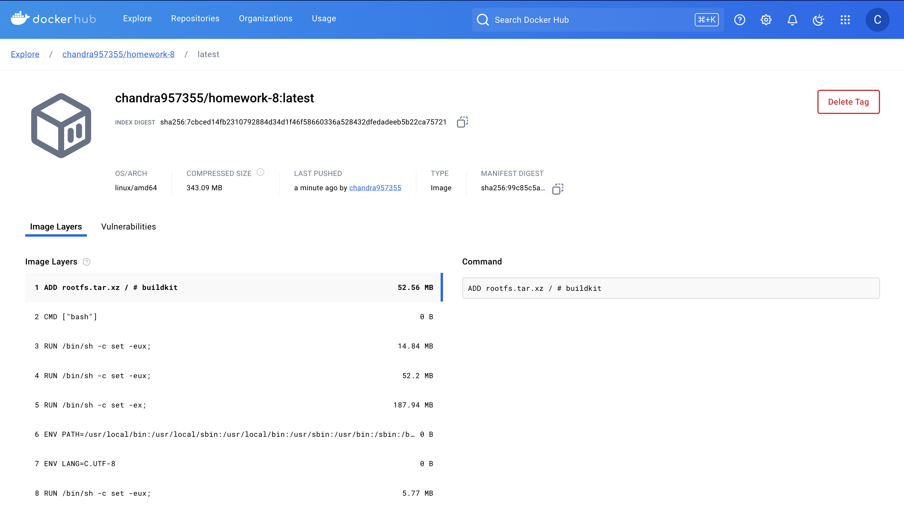
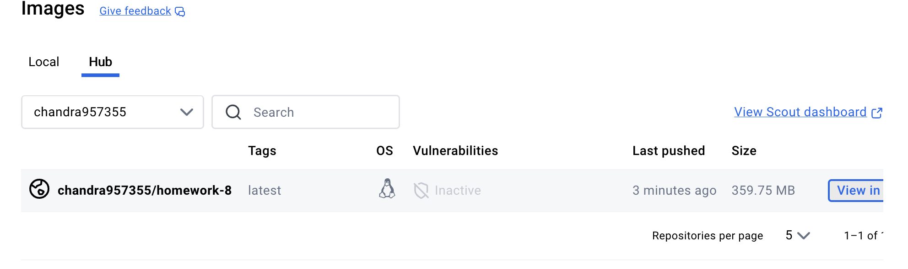

# Homework-8

This project demonstrates the use of Docker to build and push images to Docker Hub using GitHub Actions.

## Images

Below are the images from the app folder:

### Image 1: my_image

### Image 2: my_image2

